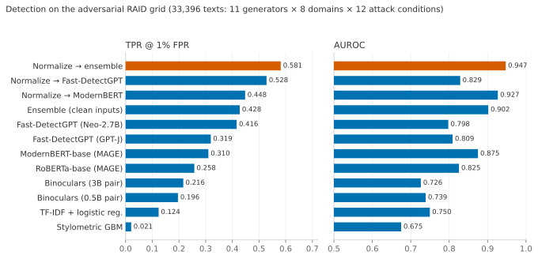
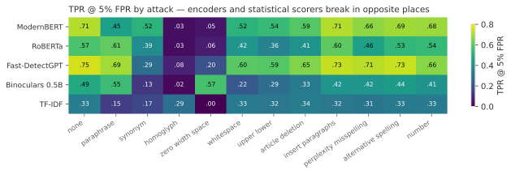
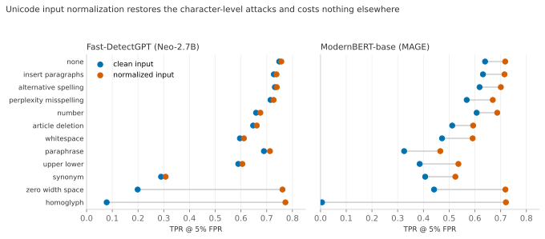

# Robust AI-Generated Text Detection — an open research project

**Summary.** We benchmark five families of AI-text detectors under distribution shift and
adversarial attack. The experiments reproduce the field's main failure modes, fail to
reproduce one published robustness claim, and show that a pipeline requiring no
additional training (Unicode input normalization, then a rank-average ensemble of a
fine-tuned encoder and a zero-shot statistical detector) raises detection at 1%
false-positive rate on the adversarial RAID grid from 12% (best simple baseline) to
**58%**, with AUROC of **0.947**.

> This repository is a research write-up as much as a codebase. Every experiment is
> logged with hypothesis, setup, result, and decision in
> [`docs/RESEARCH_LOG.md`](docs/RESEARCH_LOG.md), including the failures. The
> literature review behind it is [`docs/literature-review.md`](docs/literature-review.md)
> (~60 sources; [`docs/references.bib`](docs/references.bib)). Every number and figure
> below regenerates from committed artifacts via `scripts/make_tables.py` and
> `scripts/make_figures.py`.

## 1. Motivation and research question

Detectors of machine-generated text report near-perfect in-distribution scores, then
fail in the conditions of real use: unseen generators, unseen domains, adversarial
edits, and the low-false-positive operating points that deployment demands
[shen2026rethinking; dugan2024raid; dycke2026aitdna]. The stakes are concrete.
Commercial detectors averaged 61% false positives on essays by non-native English
writers [liang2023gpt]; OpenAI withdrew its own classifier over accuracy
[openai2023classifier]; universities, including in the Netherlands, have ruled that
detector scores are not admissible evidence of fraud [vu2024genai].

**Research question:** how far can an open, reproducible detector get on
out-of-distribution and adversarial robustness, and which method families actually
generalize?

## 2. Setup

**Data.** MAGE [li2024mage] (447K texts, 27 generators) is the supervised training
corpus and the near-in-distribution eval. HC3 [guo2023hc3] is a cross-dataset transfer
check; our audits show it is length-confounded (text length alone scores 0.73 AUROC),
so it serves only as an easy floor. RAID [dugan2024raid] is the robustness testbed: we
carve a leakage-safe eval grid of 33,396 texts from its labeled train split, stratified
over 11 generators, 8 domains, and 12 attack conditions, split by source document so
that no attacked variant of a training text can appear in eval.

**Protocol.** The primary metric is TPR at 5% and 1% FPR with thresholds calibrated on
human text, following RAID; AUROC is secondary. Hygiene checks run before any
training: generation-artifact filtering (2.2% of MAGE's ChatGPT rows begin with "As an
AI…"), normalized-text deduplication, length-shortcut audits, and per-slice reporting
by generator, domain, and attack. Seeds are fixed, and seed variance is measured where
affordable.

**Methods.** Interpretable baselines (TF-IDF with logistic regression; a stylometric
gradient-boosting model with a lexical-richness ablation [elattar2026linguistic]);
zero-shot statistical detectors (Fast-DetectGPT [bao2024fastdetectgpt] in two
configurations; Binoculars [hans2024binoculars] with matched Qwen2.5 pairs at 0.5B and
3B); fine-tuned encoders (RoBERTa-base per [shen2026rethinking]; ModernBERT-base per
[thorat2026dactyl; drayson2025collapse]); and three robustness interventions (Unicode
input normalization, rank-average ensembling, and a curated MAGE+RAID training
mixture). All detectors face an identical evaluation harness. Compute: shared NVIDIA
L4 GPUs at VU Amsterdam.

## 3. Main results



The full table, and per-generator/domain/attack slices, regenerate with
`uv run python scripts/make_tables.py --slice attack`. Findings, with details in the
[research log](docs/RESEARCH_LOG.md):

1. The out-of-distribution collapse is real, and AUROC hides its depth. Supervised
   models near the ceiling on MAGE (ModernBERT: 0.98 AUROC) drop hard on RAID, and
   TPR at 1% FPR drops much further than AUROC suggests. Two configurations of the
   same zero-shot method even swap rank between the two metrics.
2. Supervised and statistical detectors break in opposite places, which is why the
   plain rank-average ensemble works. The heatmap below makes the asymmetry visible:
   zero-width-space insertion ruins the encoders yet leaves the LLM-based scorers
   intact, synonym substitution does the reverse, and homoglyph substitution ruins
   everyone.

   

3. Unicode normalization (NFKC, zero-width stripping, a 40-entry confusables map) is
   an almost free defense: it restores both character-level attacks to clean-input
   detection levels and costs nothing on any other condition. No benchmark or
   leaderboard we reviewed mandates it as preprocessing.

   

4. One published claim did not survive a cross-dataset test: the lexical-richness
   feature trio, reported as the most shift-robust interpretable signal
   [elattar2026linguistic], transfers below chance (0.44 AUROC) from MAGE to HC3 in
   our setup. Their robustness testbeds shift within one corpus; ours crosses corpora.
5. Binoculars did not improve from a 0.5B to a 3B observer pair, which suggests pair
   matching rather than scale carries the method. Separately, the cheap self-sampling
   Fast-DetectGPT configuration beat the paper-faithful two-model configuration at
   low FPR.
6. Low-FPR metrics are noisy. Across seeds, AUROC moves by ±0.007 while TPR at 5% FPR
   for a weak detector varies 2.5×; one identical retrain of ModernBERT moved TPR at
   1% FPR by 7 points. Single-run low-FPR claims near the noise floor, ours included,
   deserve skepticism.
7. Curated data mixing gives with one hand and takes with the other. Retraining
   ModernBERT on MAGE plus a stratified RAID sample lifted TPR at 1% FPR on the
   attacked grid from 0.31 to 0.90 and left MAGE accuracy unchanged — but on M4GT, a
   corpus neither model saw, the mixture model collapses to **0.00** TPR at 1% FPR
   (0.855 AUROC) while the plain MAGE-only model transfers at 0.674 (0.920 AUROC).
   Attack exposure specialized the model to RAID's text and broke its calibration on
   unseen human writing, reproducing the high-confidence-wrong failure mode of
   [shen2026rethinking] in our own strongest checkpoint. Our pre-registered caveat
   about the mixture's RAID numbers turned out to be the finding.

8. No single supervised checkpoint is robust on every axis. A frontier probe (465
   texts by Qwen3-4B-2507, a 2025 generator no training set contains, in RAID's
   continuation format) completes a triangle of complementary collapses: the RAID-mix
   model scores 0.985 TPR at 1% FPR there but 0.00 on M4GT; the MAGE-only model the
   reverse (0.13 vs 0.67); zero-shot Fast-DetectGPT never ranks first and never
   collapses (worst case 0.42 across all three corpora). Robustness is a profile,
   not a number — which is the deepest argument for the ensemble in finding 2.

## Released models

Two checkpoints are on the Hugging Face Hub, with cards stating metrics and limits:
[`jaspai/modernbert-ai-text-detector`](https://huggingface.co/jaspai/modernbert-ai-text-detector)
(recommended: best cross-dataset transfer) and
[`jaspai/modernbert-ai-text-detector-raid-mix`](https://huggingface.co/jaspai/modernbert-ai-text-detector-raid-mix)
(RAID-attack specialist; overconfident on out-of-distribution human text — see card
warning). Pair either with the repository's Unicode normalization preprocessing.

## 4. What did not work (kept on purpose)

Lexical-richness-only stylometrics (below chance across datasets, finding 4).
Binoculars at accessible scale (both pairs trail Fast-DetectGPT everywhere). The
Falcon-7B 8-bit replication, blocked by a transformers caching-allocator bug that
pre-allocates fp16-sized memory for quantized models on 24GB cards. Infrastructure
lessons from shared university hardware (silent git-pull failures, zombie GPU jobs,
nightly SSH-key resets) are recorded in the log for anyone reproducing this in a
similar environment.

## 5. Limitations and ethics

This project measures English-only, document-level detection of fully
machine-generated text. Realistic human-AI co-writing is harder, and detectors built
for one notion of "AI text" do not transfer to others [dycke2026aitdna]. RAID's
generators are 2023-era; no public benchmark covers 2025–26 frontier models, a gap we
document rather than fill. Subgroup false-positive behavior (for example on
non-native writers) is untested here. An adaptive adversary with an RL-optimized
paraphraser defeats all published detectors [ranganath2026stealthrl], and we assume
ours as well.

Following RAID's position: detector output is probabilistic evidence, never proof,
and should not be the basis of disciplinary action. At 1% FPR, an institution
processing 75,000 papers a year would wrongly flag about 750 of them. The deployment
model this work assumes is the one Dutch universities practice: a score may at most
prompt a conversation, and misconduct is determined by an examination board
[vu2024genai].

## 6. Reproducing

```bash
git clone https://github.com/jasp-nerd/robust-ai-text-detection
cd robust-ai-text-detection && uv sync
uv run pytest                                        # 23 tests
uv run python scripts/prepare_data.py mage hc3 raid  # ~3GB download
uv run python scripts/make_raid_splits.py
uv run python scripts/run_experiment.py configs/tfidf_logreg_mage.yaml   # minutes, CPU
uv run python scripts/run_experiment.py configs/fast_detect_gpt_neo.yaml # needs a GPU
uv run python scripts/make_tables.py --slice attack
uv run python scripts/make_figures.py
```

Each YAML in `configs/` is one experiment; each JSON in `results/runs/` records its
config and git commit. Citation keys resolve in [`docs/references.bib`](docs/references.bib).

## License

MIT. If you build on this work, please cite the papers credited throughout; they did
the heavy lifting.
